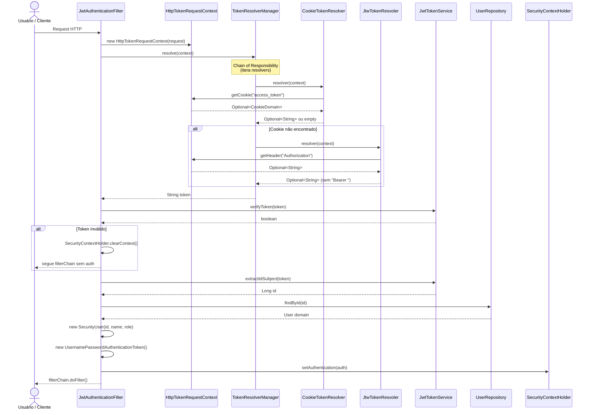
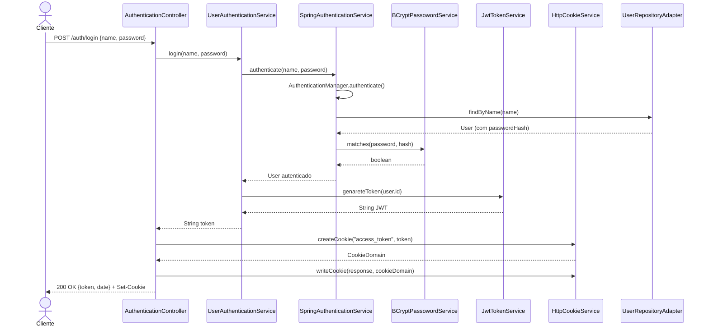
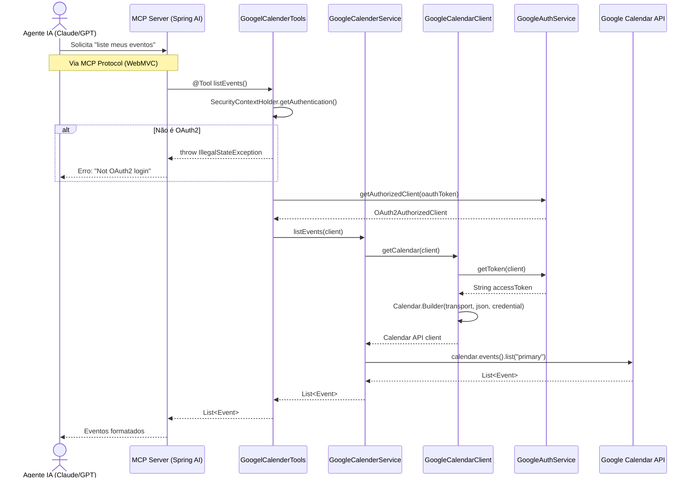

# Relatório Completo — coffe_server

> **Projeto:** `com.quitto:server:0.0.1-SNAPSHOT`
> **Stack:** Java 21 + Spring Boot 4.0.6 + Spring AI MCP 1.0.2
> **Arquitetura:** Hexagonal (Ports & Adapters / Clean Architecture)
> **Banco:** PostgreSQL (prod) / H2 (dev/teste)
> **Build:** Maven
> **Data da análise:** Julho 2026

---

## Coffee Server Architecture

The **Coffee Server** is the outermost application of the Coffee ecosystem. It is designed as an **independent monolithic service** that exposes the capabilities of the Coffee SDK through the **Model Context Protocol (MCP)** while internally following **Clean Architecture**.

Although the Coffee Server uses a traditional **MVC** structure at its entry point, the MVC layer is **not responsible for business logic**. It acts only as an adapter between external protocols and the application's use cases.

The architecture is organized as follows:

```
External Client
        │
        ▼
 MCP / REST / CLI / Other Adapters
        │
        ▼
   MVC Controllers (Entry Layer)
        │
        ▼
     Application Layer
       (Use Cases)
        │
        ▼
      Domain Layer
(Entities, Value Objects,
 Domain Services, Interfaces)
        │
        ▼
 Infrastructure Layer
(Repositories, File System,
 DNF, Docker, Git, etc.)
```

The **MCP layer** is treated as an **input adapter**, similar to a REST API, CLI, or gRPC interface. Its only responsibility is to translate incoming requests into application use cases and transform the results back into MCP responses.

This design ensures that the business rules remain completely independent of the communication protocol. The Domain and Application layers have no knowledge of MCP, HTTP, or any framework-specific technology.

The Infrastructure layer implements the interfaces defined by the inner layers and communicates with operating system resources, package managers, Docker, Git repositories, the file system, and any other external dependency required by the Coffee ecosystem.

From a deployment perspective, the Coffee Server behaves like a **standalone monolithic service**. All modules execute within the same process and share the same codebase, avoiding the operational complexity of a microservice architecture. However, because it exposes its functionality through MCP, it behaves externally like a dedicated platform service that can be consumed by multiple AI agents, desktop applications, CLIs, or future integrations.

This approach combines the simplicity and performance of a monolith with the modularity provided by Clean Architecture. New protocols (REST, CLI, WebSocket, gRPC, or additional MCP transports) can be added as new adapters without requiring changes to the Domain or Application layers.

The result is a highly maintainable architecture where:

* Business rules remain framework-independent.
* Communication protocols are isolated in the outer layer.
* Infrastructure details are fully encapsulated.
* Multiple clients can reuse the same application logic.
* The Coffee Server acts as the central orchestration point for the entire Coffee ecosystem while remaining loosely coupled to the technologies used to access it.

## Sumário

1. [Visão Geral do Projeto](#1-visão-geral-do-projeto)
2. [Problema e Contexto](#2-problema-e-contexto)
3. [Mapeamento Estrutural Completo](#3-mapeamento-estrutural-completo)
   - 3.1 [Estrutura de Diretórios (ASCII)](#31-estrutura-de-diretórios-ascii)
   - 3.2 [Classes por Camada](#32-classes-por-camada)
   - 3.3 [Tabela Interfaces vs Implementações](#33-tabela-interfaces-vs-implementações)
   - 3.4 [Tabela de Endpoints REST](#34-tabela-de-endpoints-rest)
4. [Diagramas de Fluxo](#4-diagramas-de-fluxo)
   - 4.1 [Fluxo de Autenticação (Mermaid)](#41-fluxo-de-autenticação-mermaid)
   - 4.2 [Fluxo MCP (Mermaid)](#42-fluxo-mcp-mermaid)
   - 4.3 [Relacionamento entre Camadas (Mermaid)](#43-relacionamento-entre-camadas-mermaid)
5. [Análise Arquitetural](#5-análise-arquitetural)
   - 5.1 [Resumo da Saúde Arquitetural](#51-resumo-da-saúde-arquitetural)
   - 5.2 [Análise por Camada](#52-análise-por-camada)
   - 5.3 [Violações de Clean Architecture](#53-violações-de-clean-architecture)
   - 5.4 [Diagrama de Dependências Atual vs Desejado](#54-diagrama-de-dependências-atual-vs-desejado)
6. [Ponto de Situação: O que está OK vs O que está Incompleto](#6-ponto-de-situação)
   - 6.1 [Funcionalidades Completas](#61-funcionalidades-completas)
   - 6.2 [Funcionalidades Incompletas](#62-funcionalidades-incompletas)
   - 6.3 [Typos e Inconsistências](#63-typos-e-inconsistências)
   - 6.4 [Arquivos Faltantes](#64-arquivos-faltantes)
   - 6.5 [Problemas de Segurança e Estilo](#65-problemas-de-segurança-e-estilo)
7. [Estratégia SDK: Como Transformar o Server em um Ecossistema](#7-estratégia-sdk)
   - 7.1 [Visão Geral do Ecossistema](#71-visão-geral-do-ecossistema)
   - 7.2 [O que JÁ funciona como SDK](#72-o-que-já-funciona-como-sdk)
   - 7.3 [O que PRECISA mudar para virar SDK](#73-o-que-precisa-mudar-para-virar-sdk)
   - 7.4 [Plano de Modularização Maven](#74-plano-de-modularização-maven)
   - 7.5 [Módulos Extraíveis como SDKs Independentes](#75-módulos-extraíveis-como-sdks-independentes)
   - 7.6 [Roadmap SDK: Faseado](#76-roadmap-sdk-faseado)
8. [Recomendações Priorizadas](#8-recomendações-priorizadas)
9. [Glossário de Componentes](#9-glossário-de-componentes)

---

## 1. Visão Geral do Projeto

O **coffe_server** é um servidor backend Spring Boot que expõe:

- **API REST** para autenticação (login/register) e gerenciamento de recursos
- **Autenticação JWT** via cookie ou header `Authorization: Bearer`
- **Login social** via Google OAuth2
- **Integração MCP** (Model Context Protocol) para agentes de IA
- **Gerenciamento de Máquinas** com suporte a Tailscale e Wake-on-LAN

### Stack Tecnológica

| Componente | Tecnologia |
|---|---|
| Runtime | Java 21 |
| Framework | Spring Boot 4.0.6 |
| Segurança | Spring Security + Auth0 java-jwt 4.5.2 |
| Banco | PostgreSQL (produção) / H2 (dev/teste) |
| ORM | Spring Data JPA |
| OAuth2 | Spring Security OAuth2 Client + Google Auth Library |
| IA/MCP | Spring AI MCP Server WebMVC 1.0.2 |
| Build | Maven |
| Templates | Thymeleaf |
| Monitoria | Spring Actuator |

---

## 2. Problema e Contexto

Extraído do `doc/plain.md` e do código-fonte:

**Problema real:** Quitto quer um backend central de homelab que seja:

1. **Seguro** — autenticação robusta (JWT + OAuth2)
2. **Extensível** — agentes de IA (MCP/Jarvis-like) podem consumir ferramentas
3. **Gerenciador de infra** — máquinas com Tailscale + Wake-on-LAN
4. **Integrado ao Linux** — users/groups Unix como base do sistema de arquivos
5. **Automatizado** — Google Tasks, Calendar, e futuramente mais serviços

**Visão de longo prazo:** Um backend que funciona como "cérebro" do homelab — máquinas, calendário, tarefas, automação — exposto via REST e MCP Tools para agentes de IA, formando a base de um ecossistema de agentes consistente (tipo Jarvis do Homem de Ferro).

**Público-alvo:**
- Quitto (desenvolvedor e administrador do homelab)
- Agentes de IA via MCP (Claude, GPT, etc.)
- Futuramente usuários do PS3 (Project Setup 3 Web)

**Filosofia arquitetural:** Clean Architecture / Ports & Adapters com viés em MVC clássico para facilitar a adoção do modelo.

```
Core → Infra → Service (UseCase) → View (MCP ou REST)
```

---

## 3. Mapeamento Estrutural Completo

### 3.1 Estrutura de Diretórios (ASCII)

```
com.quitto.server/
│
├── ServerApplication.java                         # Entry point @SpringBootApplication
│
├── application/                                   # ── CAMADA DE APLICAÇÃO ──
│   ├── controllers/
│   │   ├── APIController.java                     #   GET /api/test
│   │   ├── AuthenticationController.java          #   POST /auth/login, /auth/register
│   │   └── HomeController.java                    #   GET /, /login (Thymeleaf)
│   │
│   ├── dto/
│   │   ├── Auth/
│   │   │   ├── LoginDTO.java                     #   {name, password}
│   │   │   ├── LoginResponseDTO.java             #   {token, date}
│   │   │   ├── RegisterDTO.java                  #   {name, passoword, email} ← typo
│   │   │   └── RegisterResponseDTO.java          #   {Token, date} ← uppercase T
│   │   └── ErrorResponse.java                    #   {msg}
│   │
│   └── services/
│       ├── Auth/
│       │   └── UserAuthenticationService.java    # Use case: login/register
│       ├── Machine/
│       │   └── MachineService.java               # Use case: changeOwner
│       └── Users/
│           └── UserService.java                  # ⚠ ESQUELETO (só construtor)
│
├── domain/                                        # ── CAMADA DE DOMÍNIO (PURA) ──
│   ├── enums/
│   │   ├── Provaider.java                        #   GOOGLE, GITHUB ← typo
│   │   └── Role.java                             #   ADMIN, USER, MCP, API
│   │
│   ├── exception/
│   │   ├── AuthenticationException.java          # Base para falhas de auth
│   │   └── InvalidTokenException.java            # Token inválido/expirado
│   │
│   ├── interfaces/                                # PORTAS (contratos)
│   │   ├── Auth/
│   │   │   ├── AuthenticationService.java        # authenticate / register
│   │   │   └── PasswordService.java              # encode / matches
│   │   └── Token/
│   │       ├── TokenRequestContext.java          # getHeader / getCookie
│   │       ├── TokenResolver.java                # resolver(request)
│   │       └── TokenService.java                 # genareteToken / verify / extract
│   │
│   ├── models/
│   │   ├── ExternalAccount/
│   │   │   └── ExternalAccont.java               # typo no nome do arquivo
│   │   ├── LinuxAcount/                          # typo no package (Acount vs Account)
│   │   │   ├── Groups.java
│   │   │   └── LinuxUser.java
│   │   ├── Machine/
│   │   │   └── Machine.java
│   │   └── User/
│   │       └── User.java                         # passowrdHash ← typo no campo
│   │
│   ├── Repository/                                # Portas de repositório
│   │   ├── Machine/
│   │   │   └── MachineRepository.java
│   │   └── users/                                # Inconsistente: letra minúscula
│   │       └── UserRepository.java
│   │
│   └── valueobject/
│       └── CookieDomain.java                     # Imutável, auto-validado ✅
│
├── infrastructure/                                # ── CAMADA DE INFRAESTRUTURA ──
│   ├── config/
│   │   └── logger/
│   │       └── CoffeColorConverter.java          # Logback colorido
│   │
│   ├── db/                                        # PERSISTÊNCIA (JPA)
│   │   ├── LinuxUser/
│   │   │   └── Entity/
│   │   │       ├── GroupsEntity.java
│   │   │       └── LinuxUserEntity.java
│   │   │   ⚠ SEM mappers, SEM adapter, SEM Spring Data repository
│   │   │
│   │   ├── Machine/
│   │   │   ├── Adapter/MachineRepositoryAdapter.java
│   │   │   ├── Entity/MachineEntity.java
│   │   │   ├── Mapper/MachineMapper.java
│   │   │   └── Repository/JpaMachineRepository.java
│   │   │
│   │   └── User/
│   │       ├── Adapter/UserRepositoryAdapter.java
│   │       ├── Entity/{UserEntity, ExternalAccountEntity}.java
│   │       ├── Mapper/UserMapper.java
│   │       └── Repository/JpaUserRepository.java
│   │
│   ├── external/
│   │   ├── google/GoogleAuthService.java         # Obtém tokens OAuth2
│   │   └── GoogleCalendarClient.java              # Cliente Calendar API
│   │
│   ├── interfaces/                                # ⚠ DEVERIA estar no domínio
│   │   └── Cookies/
│   │       └── CookieService.java
│   │
│   ├── security/
│   │   ├── Filter/
│   │   │   ├── Adapter/HttpTokenRequestContext.java
│   │   │   ├── Token/{CookieTokenResolver, JtwTokenResvoler}.java ← typo
│   │   │   └── JwtAuthenticationFilter.java
│   │   ├── SecurityConfig.java
│   │   └── SecurityUser.java                      # Principal leve (record)
│   │
│   └── services/
│       ├── Auth/
│       │   ├── SpringAuthenticationService.java
│       │   ├── Token/
│       │   │   ├── Cookies/HttpCookieService.java
│       │   │   ├── Jtw/JwtTokenService.java
│       │   │   └── TokenResolverManager.java      # ⚠ Deveria estar na aplicação
│       │   └── UserDetailsServiceImpl.java
│       ├── BCrypt/BCryptPassowordService.java      # typo
│       └── OAuth/OAuth2UserProvisioningService.java
│
├── mcp/                                           # ── CAMADA MCP (Spring AI) ──
│   ├── services/GoogleCalenderService.java         # typo: Calender
│   └── tools/
│       ├── CalendarController.java                # REST /api/calendar/*
│       └── GoogelCalenderTools.java               # typo: Googel/Calender
│
├── shared/                                        # ── CROSS-CUTTING ──
│   ├── exception/
│   │   ├── AuthExceptionHandler.java              # @RestControllerAdvice (401)
│   │   └── MachineNotFoundException.java          # ⚠ Deveria estar no domínio
│
├── resources/
│   ├── application.properties
│   ├── application-h2.properties
│   ├── static/css/app.css
│   └── templates/
│       ├── index.html
│       └── login.html  ← NÃO EXISTE (quebra a página)
│
└── test/
    └── java/com/quitto/server/
        ├── ServerApplicationTests.java            # Smoke test
        ├── CookieSystemTest.java                  # Testes unitários
        └── CookieSystemIntegrationTest.java       # Testes de integração
```

---

### 3.2 Classes por Camada

#### Entry Point

| Classe | Arquivo |
|--------|---------|
| `ServerApplication` | `ServerApplication.java` |

#### Application Layer

| Classe | Tipo | Papel |
|--------|------|-------|
| `HomeController` | `@Controller` | GET `/`, `/login` (Thymeleaf) |
| `AuthenticationController` | `@RestController` | POST `/auth/login`, `/auth/register` |
| `APIController` | `@RestController` | GET `/api/test` |
| `LoginDTO` | `record` | Request body `{name, password}` |
| `LoginResponseDTO` | `record` | Response body `{token, date}` |
| `RegisterDTO` | `record` | Request body `{name, passoword, email}` |
| `RegisterResponseDTO` | `record` | Response body `{Token, date}` |
| `ErrorResponse` | `record` | Response body `{msg}` |
| `UserAuthenticationService` | `@Service` | Use case: orquestra login/register |
| `MachineService` | `@Service` | Use case: changeOwner |
| `UserService` | `@Service` | **ESQUELETO** (só construtor) |

#### Domain Layer

| Classe | Tipo | Papel |
|--------|------|-------|
| `Role` | `enum` | ADMIN, USER, MCP, API |
| `Provaider` | `enum` | GOOGLE, GITHUB |
| `AuthenticationException` | `class` | Exceção base de autenticação |
| `InvalidTokenException` | `class` | Token inválido/expirado |
| `AuthenticationService` | `interface` | Porta: authenticate / register |
| `PasswordService` | `interface` | Porta: encode / matches |
| `TokenService<ID>` | `interface` | Porta: genareteToken / verify / extract |
| `TokenResolver` | `interface` | Porta: resolver(request) |
| `TokenRequestContext` | `interface` | Porta: getHeader / getCookie |
| `UserRepository` | `interface` | Porta: CRUD usuário |
| `MachineRepository` | `interface` | Porta: CRUD máquina |
| `User` | `class` | Agregado raiz do sistema |
| `Machine` | `class` | Máquina gerenciada |
| `ExternalAccont` | `class` | Conta OAuth externa |
| `LinuxUser` | `class` | Usuário Linux |
| `Groups` | `class` | Grupo Linux |
| `CookieDomain` | `record` | Value Object imutável ✅ |

#### Infrastructure Layer

| Classe | Tipo | Papel |
|--------|------|-------|
| `SecurityConfig` | `@Configuration` | Spring Security chain |
| `SecurityUser` | `record` | Principal leve (sem password hash) |
| `JwtAuthenticationFilter` | `@Component` | Filter JWT (OncePerRequestFilter) |
| `HttpTokenRequestContext` | `class` | Adapter: Servlet → TokenRequestContext |
| `CookieTokenResolver` | `@Component` | Lê token do cookie `access_token` |
| `JtwTokenResvoler` | `@Component` | Lê token do header Authorization |
| `TokenResolverManager` | `@Service` | Chain of Responsibility |
| `JwtTokenService` | `@Service` | HMAC256, issuer `coffe-api`, 1h expiry |
| `HttpCookieService` | `@Service` | CookieService para Jakarta Servlet |
| `SpringAuthenticationService` | `@Service` | Implementa AuthenticationService |
| `UserDetailsServiceImpl` | `@Service` | Loads user by username |
| `BCryptPassowordService` | `@Service` | Implementa PasswordService |
| `OAuth2UserProvisioningService` | `@Service` | Auto-provisionamento Google OAuth2 |
| `GoogleAuthService` | `@Service` | Gerencia tokens OAuth2 client |
| `GoogleCalendarClient` | `@Service` | Constrói cliente Calendar API |
| `UserRepositoryAdapter` | `@Repository` | Implementa UserRepository |
| `MachineRepositoryAdapter` | `@Repository` | Implementa MachineRepository |
| `UserMapper` | `class` | UserEntity ↔ User |
| `MachineMapper` | `class` | MachineEntity ↔ Machine |
| `JpaUserRepository` | `interface` | Spring Data JPA |
| `JpaMachineRepository` | `interface` | Spring Data JPA |
| `UserEntity` | `@Entity` | Tabela `user` |
| `ExternalAccountEntity` | `@Entity` | Tabela `external_account` |
| `MachineEntity` | `@Entity` | Tabela `machine` |
| `LinuxUserEntity` | `@Entity` | Tabela `linux_user` |
| `GroupsEntity` | `@Entity` | Tabela `groups` |
| `CookieService` | `interface` | **⚠ NA INFRA — devia estar no domínio** |
| `CoffeColorConverter` | `class` | Logback color converter |

#### MCP Layer

| Classe | Tipo | Papel |
|--------|------|-------|
| `GoogleCalenderService` | `@Service` | Lista/cria eventos no Calendar |
| `GoogelCalenderTools` | `class` | **⚠ SEM @Component** — métodos `@Tool` |
| `CalendarController` | `@RestController` | GET `/api/calendar/test`, `/events`, `/debug/auth` |

#### Shared / Cross-cutting

| Classe | Tipo | Papel |
|--------|------|-------|
| `AuthExceptionHandler` | `@RestControllerAdvice` | Captura AuthenticationException → 401 |
| `MachineNotFoundException` | `class` | Exception para máquina não encontrada |

---

### 3.3 Tabela Interfaces vs Implementações

| Interface (Porta) | Localização | Implementação | Localização da Impl | Padrão |
|---|---|---|---|---|
| `AuthenticationService` | `domain/interfaces/Auth/` | `SpringAuthenticationService` | `infrastructure/services/Auth/` | Adapter (Spring Security → domínio) |
| `PasswordService` | `domain/interfaces/Auth/` | `BCryptPassowordService` | `infrastructure/services/BCrypt/` | Adapter (BCrypt → domínio) |
| `TokenService<Long>` | `domain/interfaces/Token/` | `JwtTokenService` | `infrastructure/services/Auth/Token/Jtw/` | Adapter (Auth0 → domínio) |
| `TokenResolver` | `domain/interfaces/Token/` | `CookieTokenResolver` | `infrastructure/security/Filter/Token/` | Reader de cookie |
| `TokenResolver` | `domain/interfaces/Token/` | `JtwTokenResvoler` | `infrastructure/security/Filter/Token/` | Reader de header |
| `TokenRequestContext` | `domain/interfaces/Token/` | `HttpTokenRequestContext` | `infrastructure/security/Filter/Adapter/` | Adapter (Servlet → domínio) |
| `UserRepository` | `domain/Repository/users/` | `UserRepositoryAdapter` | `infrastructure/db/User/Adapter/` | Adapter (JPA → domínio) |
| `MachineRepository` | `domain/Repository/Machine/` | `MachineRepositoryAdapter` | `infrastructure/db/Machine/Adapter/` | Adapter (JPA → domínio) |
| `CookieService` | **⚠ `infrastructure/interfaces/Cookies/`** | `HttpCookieService` | `infrastructure/services/Auth/Token/Cookies/` | **Interface em camada errada** |

---

### 3.4 Tabela de Endpoints REST

| Método | Rota | Controller | Acesso | Descrição |
|--------|------|-----------|--------|-----------|
| `GET` | `/` | `HomeController` | Público | Landing page (Thymeleaf) |
| `GET` | `/login` | `HomeController` | Público | Página de login (Thymeleaf) |
| `POST` | `/auth/login` | `AuthenticationController` | Público | Login name+password → JWT + cookie |
| `POST` | `/auth/register` | `AuthenticationController` | Público | Registro → JWT |
| `GET` | `/api/test` | `APIController` | Público | Health check / echo do usuário |
| `GET` | `/api/calendar/test` | `CalendarController` | Público | Teste calendar |
| `GET` | `/api/calendar/debug/auth` | `CalendarController` | Público | Debug auth context |
| `GET` | `/api/calendar/events` | `CalendarController` | Público | Lista eventos Google Calendar |
| `GET` | `/mcp/**` | (MCP tools) | `ROLE_MCP` | Endpoints MCP do Spring AI |
| `GET` | `/admin/**` | (futuro) | `ROLE_ADMIN` | Administração |
| `GET` | `/oauth2/authorization/google` | (Spring Security) | Público | Inicia fluxo OAuth2 Google |
| `GET` | `/login/oauth2/code/google` | (Spring Security) | Público | Callback OAuth2 |

---

## 4. Diagramas de Fluxo

### 4.1 Fluxo de Autenticação (Mermaid)



#### Fluxo de Login (Controller → Service)



---

### 4.2 Fluxo MCP (Mermaid)



---

### 4.3 Relacionamento entre Camadas (Mermaid)

```mermaid
classDiagram
    %% ── DOMAIN LAYER ──
    namespace Domain {
        class AuthenticationService {
            <<interface>>
            +authenticate(username, password) User
            +register(name, password, email) User
        }
        class PasswordService {
            <<interface>>
            +encode(raw) String
            +matches(raw, hash) boolean
        }
        class TokenService~ID~ {
            <<interface>>
            +genareteToken(id) String
            +verifyToken(token) boolean
            +extractIdSubject(token) ID
        }
        class TokenResolver {
            <<interface>>
            +resolver(request) Optional~String~
        }
        class TokenRequestContext {
            <<interface>>
            +getHeader(name) Optional~String~
            +getCookie(name) Optional~CookieDomain~
        }
        class UserRepository {
            <<interface>>
            +save(user) User
            +findById(id) Optional~User~
            +findByName(name) Optional~User~
        }
        class MachineRepository {
            <<interface>>
            +save(machine) Machine
            +findById(id) Optional~Machine~
        }
        class User {
            -id long
            -name String
            -passowrdHash String
            -email String
            -role Role
        }
        class Machine {
            -id Long
            -hostname String
            -tailscaleNodeKey String
            -macAddress String
            -wolEnabled boolean
            +changeOwner(user) void
        }
        class CookieDomain {
            <<record>>
            -name String
            -value String
            -httpOnly boolean
            -secure boolean
        }
    }

    %% ── APPLICATION LAYER ──
    namespace Application {
        class AuthenticationController {
            +login(dto, response) ResponseEntity
            +register(dto) ResponseEntity
        }
        class UserAuthenticationService {
            +login(name, password) String
            +register(name, password, email) String
        }
        class MachineService {
            +changeOwner(machineId, userId) void
        }
    }

    %% ── INFRASTRUCTURE LAYER ──
    namespace Infrastructure {
        class JwtAuthenticationFilter
        class TokenResolverManager
        class CookieTokenResolver
        class JtwTokenResvoler
        class HttpTokenRequestContext
        class JwtTokenService
        class SpringAuthenticationService
        class BCryptPassowordService
        class HttpCookieService
        class UserRepositoryAdapter
        class MachineRepositoryAdapter
        class GoogleAuthService
        class GoogleCalendarClient
        class OAuth2UserProvisioningService
    }

    %% ── MCP LAYER ──
    namespace MCP {
        class GoogelCalenderTools
        class CalendarController
        class GoogleCalenderService
    }

    %% ── DEPENDÊNCIAS ──
    %% Application → Domain
    AuthenticationController --> UserAuthenticationService
    AuthenticationController --> HttpCookieService
    UserAuthenticationService --> AuthenticationService
    UserAuthenticationService --> TokenService
    MachineService --> MachineRepository
    MachineService --> UserRepository

    %% Infrastructure → Domain
    JwtAuthenticationFilter --> TokenService
    JwtAuthenticationFilter --> UserRepository
    JwtAuthenticationFilter --> TokenResolverManager
    TokenResolverManager --> TokenResolver
    CookieTokenResolver ..|> TokenResolver
    JtwTokenResvoler ..|> TokenResolver
    HttpTokenRequestContext ..|> TokenRequestContext
    JwtTokenService ..|> TokenService
    SpringAuthenticationService ..|> AuthenticationService
    BCryptPassowordService ..|> PasswordService
    UserRepositoryAdapter ..|> UserRepository
    MachineRepositoryAdapter ..|> MachineRepository
    HttpCookieService ..|> CookieService

    %% MCP → Infrastructure
    GoogelCalenderTools --> GoogleCalenderService
    GoogelCalenderTools --> GoogleAuthService
    GoogleCalenderService --> GoogleCalendarClient
    CalendarController --> GoogleCalenderService
    GoogleCalendarClient --> GoogleAuthService
```



---

## 5. Análise Arquitetural

### 5.1 Resumo da Saúde Arquitetural

**Nota: 🟡 6/10 — EM DESENVOLVIMENTO COM DESVIOS**

O projeto **demonstra conhecimento genuíno** de Clean Architecture / Hexagonal Architecture. O desenvolvedor entende os conceitos de Ports & Adapters, separação de camadas, e SOLID — isso é impressionante para um desenvolvedor de 16 anos.

| Aspecto | Nota | Status |
|---------|------|--------|
| Estrutura de diretórios | 🟢 9/10 | Segue fielmente arquitetura hexagonal |
| Domínio puro (sem frameworks) | 🟢 9/10 | Nenhum import de framework no domínio |
| Ports & Adapters | 🟢 8/10 | TokenResolver + TokenRequestContext são exemplares |
| Typos e nomes | 🔴 3/10 | Múltiplos typos em classes públicas |
| Interfaces na camada certa | 🟡 5/10 | CookieService está na infra (deveria ser domínio) |
| Null safety | 🔴 4/10 | extractIdSubject retorna null |
| Domínio rico (comportamento) | 🟡 5/10 | Modelos anêmicos (data bags) |
| Testes | 🟡 5/10 | Só testa cookie system |
| MCP Layer | 🟡 5/10 | GoogelCalenderTools sem @Component |

---

### 5.2 Análise por Camada

#### 🟢 Domínio — BEM ESTRUTURADO (com ressalvas)

**Acertos:**
- ✅ Nenhuma dependência de Spring, Jakarta ou frameworks externos
- ✅ `CookieDomain` é um record imutável com auto-validação
- ✅ Exceções de domínio puras (`AuthenticationException`, `InvalidTokenException`)
- ✅ Interfaces (portas) separadas por domínio (`Auth`, `Token`)
- ✅ Repository interfaces no domínio

**Problemas:**
| Gravidade | Arquivo | Problema |
|-----------|---------|----------|
| 🔴 Alta | `Provaider.java` | Typpo: `Provaider` → `Provider` |
| 🔴 Alta | `ExternalAccont.java` | Typpo: `Accont` → `Account` |
| 🔴 Alta | `MachineRepository.java:22` | `setOwner()` retorna `User` — interface confusa |
| 🟡 Média | `User.java` | `passowrdHash` — typpo no campo |
| 🟡 Média | `Machine.java` | Parâmetros: `tailsclae_node_key`, `curent_ip`, `mac_adress` |
| 🟢 Baixa | `User.java:33` | Construtor vazio público — permite estado inválido |

**Anemia de domínio:** Modelos são predominantemente **data bags** (só dados, pouco comportamento). Idealmente operações como `Machine.wakeOnLan()`, `User.activateMfa()`, `ExternalAccount.refreshTokenIfExpired()` deveriam estar no domínio.

---

#### 🟡 Aplicação — BOM COM FALHAS

**Acertos:**
- ✅ `UserAuthenticationService` orquestra use-cases sem lógica de negócio
- ✅ `MachineService` bem estruturado como use-case
- ✅ DTOs são records imutáveis
- ✅ Controller faz apenas orquestração básica

**Problemas:**
| Gravidade | Arquivo | Problema |
|-----------|---------|----------|
| 🟡 Média | `MachineService.java:28` | Lança `UsernameNotFoundException` (Spring) — vazamento de framework |
| 🟡 Média | `AuthenticationController.java:59` | Validação de senha no controller — deveria estar no DTO |
| 🟡 Média | `RegisterResponseDTO.java` | `String Token` capitalizado — inconsistente com `LoginResponseDTO.token` |
| 🟡 Média | `AuthenticationController.java:14` | Import `javax.validation.Valid` — mistura javax com jakarta |

---

#### 🔴 Infraestrutura — VIOLAÇÕES GRAVES

**Acertos:**
- ✅ Repository Adapters isolam JPA corretamente
- ✅ `HttpTokenRequestContext` é um adapter limpo e correto
- ✅ Constructor injection na maioria dos serviços

**Problemas:**
| Gravidade | Arquivo | Problema |
|-----------|---------|----------|
| 🔴 Crítica | `infrastructure/interfaces/Cookies/CookieService.java` | Interface de DOMÍNIO está na INFRAESTRUTURA |
| 🔴 Crítica | `CookieService.java:13,15` | `toFrameworkCookie()` recebe `HttpServletResponse` — dependência de Jakarta |
| 🔴 Crítica | `JwtTokenService.java:72` | `return null` — deveria retornar `Optional<Long>` |
| 🔴 Alta | `JwtTokenService.java` | Imports incorretos de Hibernate + Jakarta |
| 🔴 Alta | `JtwTokenResvoler.java` | Typpo: `Jtw` + `Resvoler` |
| 🔴 Alta | `BCryptPassowordService.java` | Typpo: `Passoword` |
| 🔴 Alta | `OAuth2UserProvisioningService.java` | Usa `JpaUserRepository` direto em vez da porta `UserRepository` |
| 🔴 Alta | `MachineRepositoryAdapter.java:85-87` | `setOwner()` retorna `new User()` — STUB perigoso |
| 🟡 Média | `TokenResolverManager.java` | Deveria estar em `application/`, não em `infrastructure/` |
| 🟡 Média | `UserRepositoryAdapter.java:17-18` | Field injection (`@Autowired`) |
| 🟡 Média | `HttpCookieService.java:33` | `cookie.setDomain("coffe_server")` hardcoded |
| 🟢 Baixa | `JwtAuthenticationFilter.java` | Nomes de variáveis `NE`, `JTWVE` em caixa alta |

---

#### 🟡 MCP — PROBLEMAS DE DESIGN

| Gravidade | Arquivo | Problema |
|-----------|---------|----------|
| 🟡 Média | `GoogelCalenderTools.java:19-23` | `@Autowired` em campo público — field injection |
| 🟡 Média | `GoogelCalenderTools.java:38-40` | `System.err.println()` — deveria usar logger |
| 🟡 Média | `CalendarController.java` | `System.out.println()` em produção |
| 🟢 Baixa | `GoogelCalenderTools.java` | SEM `@Component` — métodos `@Tool` não descobertos |
| 🟢 Baixa | `GoogleCalenderService.createEvent()` | Retorna `""` — stub |

---

### 5.3 Violações de Clean Architecture

#### 🔴 Críticas (corrigir AGORA)

| # | Violação | Localização | Princípio Violado |
|---|---|---|---|
| C1 | Interface `CookieService` na infraestrutura | `infrastructure/interfaces/Cookies/CookieService.java` | **Dependency Rule**: portas devem estar no domínio |
| C2 | `CookieService.toFrameworkCookie()` depende de Jakarta | `CookieService.java:13` | **Interface Segregation**: método de framework na interface |
| C3 | `JwtTokenService.extractIdSubject()` retorna `null` | `JwtTokenService.java:72` | **Null safety**: viola o contrato |
| C4 | `JtwTokenResvoler` — nome quebrado | `JtwTokenResvoler.java:11` | **API pública**: nome com typo |
| C5 | `BCryptPassowordService` — typo | `BCryptPassowordService.java:9` | **API pública**: nome com typo |
| C6 | `Provaider` — typo no enum | `domain/enums/Provaider.java` | **Domínio**: erro em conceito fundamental |
| C7 | `MachineRepositoryAdapter.setOwner()` retorna `new User()` vazio | `MachineRepositoryAdapter.java:85-87` | **Liskov Substitution**: não cumpre o contrato |

#### 🟡 Importantes (corrigir no médio prazo)

| # | Violação | Localização | Princípio Violado |
|---|---|---|---|
| I1 | `TokenResolverManager` na infraestrutura | `TokenResolverManager.java` | **Dependency Rule**: use-case na camada errada |
| I2 | `OAuth2UserProvisioningService` usa JPA direto | `OAuth2UserProvisioningService.java` | **Dependency Inversion**: pula a porta |
| I3 | `MachineService` lança exceção Spring | `MachineService.java:28` | **Dependency Rule**: vazamento de framework |
| I4 | Field injection em `UserRepositoryAdapter` | `UserRepositoryAdapter.java:17-18` | **DIP**: menos testável |
| I5 | `System.out/err` em produção | `GoogelCalenderTools.java`, `CalendarController.java` | **Logging**: usar SLF4J |
| I6 | Domínio anêmico | `User.java`, `Machine.java`, etc. | **Domain Model**: data bags |
| I7 | `RegisterResponseDTO.Token` com T maiúsculo | `RegisterResponseDTO.java` | **Consistência de API** |

---

### 5.4 Diagrama de Dependências Atual vs Desejado

#### ATUAL — Com violações

```mermaid
graph TD
    subgraph "Application Layer"
        AC[AuthenticationController]
        MC[MachineService]
        UAS[UserAuthenticationService]
    end
    
    subgraph "Domain Layer"
        UR[UserRepository]
        MR[MachineRepository]
        TS[TokenService]
        TR[TokenResolver]
        TRC[TokenRequestContext]
        AS[AuthenticationService]
        PS[PasswordService]
        CD[CookieDomain]
    end
    
    subgraph "Infrastructure Layer ❌"
        CS[<span style='color:red'>CookieService ← DEVERIA estar no Domínio</span>]
        TRM[<span style='color:orange'>TokenResolverManager ← DEVERIA estar em Application</span>]
        JTS[JwtTokenService ❌ imports Hibernate/Jakarta]
        SAT[SpringAuthService]
        BPS[BCryptPasswordService ❌ typo]
        JWTFR[JtwTokenResvoler ❌ typo]
        CTR[CookieTokenResolver]
        HTTRC[HttpTokenRequestContext]
        URA[UserRepositoryAdapter ❌ field injection]
        MRA[MachineRepositoryAdapter ❌ stub setOwner]
    end
    
    subgraph "MCP Layer"
        GCT[GoogelCalenderTools ❌ typo]
        GCS[GoogleCalenderService ❌ typo]
    end
    
    TRM --> TR
    TRM --> TRC
    CS -.-> |❌ importa| HttpServletResponse
    GCS -.-> |❌ importa| GoogleCalendarClient
```



#### DESEJADO — Após correções

```mermaid
graph TD
    subgraph "Application Layer"
        AC[AuthenticationController]
        MC[MachineService]
        UAS[UserAuthenticationService]
        TRM[TokenResolverManager ✅ movido p/ application]
    end
    
    subgraph "Domain Layer"
        UR[UserRepository]
        MR[MachineRepository]
        TS[TokenService]
        TR[TokenResolver]
        TRC[TokenRequestContext]
        AS[AuthenticationService]
        PS[PasswordService]
        CD[CookieDomain]
        CS[CookieService ✅ movido p/ domínio]
    end
    
    subgraph "Infrastructure Layer"
        JTS[JwtTokenService ✅ sem imports incorretos]
        SAT[SpringAuthService]
        BPS[BCryptPasswordService ✅ nome corrigido]
        JWTFR[JwtTokenResolver ✅ nome corrigido]
        CTR[CookieTokenResolver]
        HTTRC[HttpTokenRequestContext]
        URA[UserRepositoryAdapter ✅ constructor injection]
        MRA[MachineRepositoryAdapter ✅ sem stubs]
        HCS[HttpCookieService ✅ dependência limpa]
    end
    
    subgraph "External / MCP"
        GCT[GoogleCalendarTools ✅ nome corrigido]
        GCS[GoogleCalendarService ✅ nome corrigido]
        GAS[GoogleAuthService]
        GCC[GoogleCalendarClient]
    end
    
    %% Todas as setas apontam para dentro → DOMÍNIO
    AC --> UAS
    AC --> CS
    UAS --> AS
    UAS --> TS
    MC --> MR
    MC --> UR
    TRM --> TR
    TRM --> TRC
    SAT --> AS
    SAT --> PS
    SAT --> UR
    JTS --> TS
    BPS --> PS
    JWTFR --> TR
    CTR --> TR
    HTTRC --> TRC
    URA --> UR
    MRA --> MR
    HCS --> CS
    HCS --> CD
    GCT --> GCS
    GCT --> GAS
    GCS --> GCC
    GAS --> GCC
```



---

## 6. Ponto de Situação

### 6.1 Funcionalidades Completas

| Funcionalidade | Status | Observação |
|---|---|---|
| Autenticação JWT (cookie + Bearer) | ✅ Completo | Filter + TokenResolver chain funcional |
| Login/Register REST | ✅ Completo | Com cookie + response body |
| Google OAuth2 login | ✅ Completo | Auto-provisionamento de usuários |
| TokenResolver chain | ✅ Completo | Chain of Responsibility funcional |
| CookieDomain value object | ✅ Completo | Imutável, validado, seguro |
| Repository Adapter pattern (User/Machine) | ✅ Completo | Domain → Mapper → Entity → JPA |
| Testes de cookie system | ✅ Completo | Unitários + integração |

### 6.2 Funcionalidades Incompletas

| Funcionalidade | Status | O que falta |
|---|---|---|
| **LinuxUser/Groups persistence** | ⚠ Incompleto | Domain + Entity existem, mas SEM mappers, adapters, nem Spring Data repos |
| **ExternalAccount persistence** | ⚠ Incompleto | Entity existe no JPA, mas domain `ExternalAccont` SEM mapper nem adapter |
| **Wake-on-LAN** | ⚠ Incompleto | Machine tem `wolEnabled` + `macAddress`, mas SEM implementação de magic packet |
| **Tailscale integration** | ⚠ Incompleto | Machine tem `tailscaleNodeKey`, mas SEM integração real com Tailscale API |
| **Google Calendar createEvent** | ⚠ Incompleto | `GoogleCalenderService.createEvent()` retorna `""` — stub |
| **MachineService.setOwner** | ⚠ Incompleto | `MachineRepositoryAdapter.setOwner()` retorna `new User()` vazio |
| **UserService** | ❌ Esqueleto | Só tem construtor — nenhum método implementado |
| **PS3 (Project Setup 3) features** | ❌ Não iniciado | Mencionado no `plain.md` mas sem código |
| **Gerenciamento de arquivos/backup** | ❌ Não iniciado | Mencionado como objetivo |
| **API Key resolver** | ❌ Não iniciado | Mencionado como futura feature |
| **Redis cache** | ❌ Não iniciado | Mencionado como necessidade futura |
| **Página /login (Thymeleaf)** | ❌ Não existe | `HomeController.login()` retorna `"login"` mas o template não existe |

### 6.3 Typos e Inconsistências

| Local | Problema | Correção Sugerida |
|-------|----------|-------------------|
| `BCryptPassowordService.java` | `Passoword` | `BCryptPasswordService` |
| `JtwTokenResvoler.java` | `Jtw` / `Resvoler` | `JwtTokenResolver` |
| `TokenService.java` | `genareteToken(id)` | `generateToken(id)` |
| `TokenResolver.java` | `resolver(request)` | `resolve(request)` |
| `GoogelCalenderTools.java` | `Googel` / `Calender` | `GoogleCalendarTools` |
| `GoogleCalenderService.java` | `Calender` | `GoogleCalendarService` |
| `Provaider.java` | `Provaider` | `Provider` |
| `ExternalAccont.java` | `Accont` | `ExternalAccount` |
| `LinuxAcount/` | `Acount` | `LinuxAccount` |
| `User.java` | `passowrdHash` | `passwordHash` |
| `Machine.java` | `tailsclae_node_key`, `curent_ip`, `mac_adress` | Corrigir para camelCase |
| `RegisterResponseDTO.java` | `Token` (maiúsculo) | `token` (minúsculo) |
| `RegisterDTO.java` | `passoword` | `password` |
| `PasswordService.java` | parâmetro `passoword_hash` | `passwordHash` |
| `Groups.java` | `isIs_active()` | `isActive()` |
| `domain/Repository/users/` | `users` minúsculo | `User` (consistente) |
| `JwtAuthenticationFilter.java` | variáveis `NE`, `JTWVE` | Nomes descritivos |

### 6.4 Arquivos Faltantes

| Arquivo | Referenciado em | Impacto |
|---------|----------------|---------|
| `src/main/resources/templates/login.html` | `HomeController.login()` | **ERRO 404** ao acessar `/login` |
| `src/main/resources/logback-spring.xml` | `doc/arquiteture.md` | Logging usa default (sem cor) |
| `src/main/resources/data-h2.sql` | `application-h2.properties` | Pode ser opcional com `ddl-auto=create-drop` |

### 6.5 Problemas de Segurança e Estilo

| Problema | Localização | Risco |
|----------|-------------|-------|
| `JwtAuthenticationFilter` catch genérico (NPE, etc.) | `JwtAuthenticationFilter.java` | Erros silenciados — sem log nem resposta |
| `HttpCookieService.setDomain("coffe_server")` hardcoded | `HttpCookieService.java:33` | Inflexível para deploy em produção |
| `OAuth2UserProvisioningService` cria User sem password | `OAuth2UserProvisioningService.java` | `passwordHash = null` — pode causar `ConstraintViolationException` |
| `AuthenticationController` register retorna 401 sem motivo claro | `AuthenticationController.java:59-67` | Experiência de uso pobre |
| Import `javax.validation.Valid` vs Jakarta | `AuthenticationController.java:14` | Pode não funcionar no Spring Boot 4.x |

---

## 7. Estratégia SDK: Como Transformar o Server em um Ecossistema

### 7.1 Visão Geral do Ecossistema

A ideia é que o **coffe_server** não seja apenas um servidor rodando, mas sim o **núcleo central** de um ecossistema de componentes que compartilham o mesmo domínio, as mesmas portas e as mesmas implementações de infraestrutura.

```
                    ┌──────────────────────┐
                    │   🧠 coffe_server    │
                    │   (Spring Boot App)  │
                    └────────┬─────────────┘
                             │
              ┌──────────────┼──────────────┐
              │              │              │
              ▼              ▼              ▼
     ┌────────────┐  ┌────────────┐  ┌────────────┐
     │   CLI App  │  │  Web App   │  │   Agente   │
     │  (Rust/Py) │  │   (PS3)    │  │  IA (MCP)  │
     └────────────┘  └────────────┘  └────────────┘
              │              │              │
              └──────────────┼──────────────┘
                             │
                             ▼
              ┌──────────────────────────┐
              │   ☕ coffe-domain.jar     │
              │   (SDK compartilhada)     │
              │   Domínio puro + Portas   │
              └──────────────────────────┘
                             │
              ┌──────────────┼──────────────┐
              │              │              │
              ▼              ▼              ▼
     ┌────────────┐  ┌────────────┐  ┌────────────┐
     │coffe-infra │  │coffe-mcp   │  │coffe-auth  │
     │(JPA, Redis)│  │(Spring AI) │  │(JWT, OAuth)│
     └────────────┘  └────────────┘  └────────────┘
```

### 7.2 O que JÁ funciona como SDK

| Componente | Por que funciona | Pode ser extraído? |
|------------|-----------------|-------------------|
| `domain/` | 100% puro — sem Spring, sem Jakarta | ✅ **IMEDIATO** |
| `CookieDomain` | Value Object imutável sem dependências | ✅ **IMEDIATO** |
| `TokenService` interface | Porta genérica com `<ID extends Number>` | ✅ **IMEDIATO** |
| `TokenResolver` + `TokenRequestContext` | Interfaces de domínio | ✅ **IMEDIATO** |
| `AuthenticationService` + `PasswordService` | Interfaces de domínio | ✅ **IMEDIATO** |
| `UserRepository` + `MachineRepository` | Interfaces de repositório | ✅ **IMEDIATO** |
| `User`, `Machine`, `ExternalAccount` | Modelos puros (sem annotations) | ✅ **IMEDIATO** |
| DTOs (`LoginDTO`, etc.) | Records puros | ✅ **IMEDIATO** |

> **7 de 10 pacotes podem ser extraídos AGORA** sem precisar modificar uma linha de código.

### 7.3 O que PRECISA mudar para virar SDK

#### 🔴 Impeditivos (bloqueiam a extração)

| # | Problema | Impacto na SDK | Solução |
|---|---|---|---|
| 1 | `CookieService` na infraestrutura | Domínio não pode ser extraído sem mover essa interface | Mover `CookieService` para `domain/interfaces/Cookies/` |
| 2 | `CookieService` depende de `HttpServletResponse` | Interface de domínio contaminada com Jakarta | Separar `CookieDomain` + `CookieService` (domínio) de `CookieWriter` (infra) |
| 3 | Typos em classes públicas | API pública da SDK inconsistente | Renomear todas as classes com typo |
| 4 | `null` em `extractIdSubject()` | SDK insegura — clientes podem receber NPE | Mudar para `Optional<ID>` |

#### 🟡 Necessários (precisam ser resolvidos)

| # | Problema | Impacto na SDK | Solução |
|---|---|---|---|
| 5 | `TokenResolverManager` na infra | Use-case não extraível | Mover para `application/services/` |
| 6 | `OAuth2UserProvisioningService` usa JPA direto | Não pode ser usado sem Spring Data | Injetar `UserRepository` (porta) |
| 7 | Domínio anêmico | SDK teria só dados, sem lógica | Mover regras de negócio para os models |
| 8 | Field injection em alguns serviços | Não funciona sem Spring | Trocar para constructor injection |

#### 🟢 Desejáveis (otimizações)

| # | Melhoria | Benefício |
|---|---|---|
| 9 | Modularização Maven (multi-module) | Cada módulo vira um JAR independente |
| 10 | Publicação no GitHub Packages / Maven Local | `mvn install` disponibiliza SDK |
| 11 | JavaDoc completo na SDK | Documentação inline para quem consumir |
| 12 | Testes unitários do domínio | SDK testável sem Spring Boot |

---

### 7.4 Plano de Modularização Maven

```
server/                                          # Projeto raiz (pom.xml pai)
│
├── server-domain/                               # Módulo: DOMÍNIO PURO
│   ├── pom.xml                                  #   Zero dependências externas
│   └── src/main/java/com/quitto/server/domain/
│       ├── enums/
│       ├── exception/
│       ├── interfaces/
│       ├── models/
│       ├── Repository/
│       └── valueobject/
│
├── server-application/                          # Módulo: USE CASES
│   ├── pom.xml                                  #   Depende de server-domain
│   └── src/main/java/com/quitto/server/application/
│       ├── dto/
│       └── services/
│
├── server-infrastructure/                       # Módulo: IMPLEMENTAÇÕES
│   ├── pom.xml                                  #   Depende de server-domain + server-application
│   └── src/main/java/com/quitto/server/infrastructure/
│       ├── db/
│       ├── security/
│       ├── external/
│       └── services/
│
├── server-mcp/                                  # Módulo: MCP TOOLS
│   ├── pom.xml                                  #   Depende de server-domain
│   └── src/main/java/com/quitto/server/mcp/
│
├── server-boot/                                 # Módulo: SPRING BOOT APP
│   ├── pom.xml                                  #   Depende de TODOS os módulos
│   ├── src/main/java/com/quitto/server/
│   │   └── ServerApplication.java
│   └── src/main/resources/
│       ├── application.properties
│       └── templates/
│
└── pom.xml                                      # POM pai (packaging: pom)
```

**Exemplo do `server-domain/pom.xml`:**

```xml
<?xml version="1.0" encoding="UTF-8"?>
<project>
    <modelVersion>4.0.0</modelVersion>
    <parent>
        <groupId>com.quitto</groupId>
        <artifactId>server</artifactId>
        <version>0.0.1-SNAPSHOT</version>
    </parent>
    <artifactId>server-domain</artifactId>
    <packaging>jar</packaging>
    <description>Domínio puro do coffe_server — zero dependências</description>

    <dependencies>
        <!-- NENHUMA dependência externa -->
        <!-- O domínio é 100% Java puro -->
    </dependencies>
</project>
```

**Como consumir a SDK em outros projetos:**

```xml
<!-- Projeto CLI consumindo o domínio -->
<dependency>
    <groupId>com.quitto</groupId>
    <artifactId>server-domain</artifactId>
    <version>0.0.1-SNAPSHOT</version>
</dependency>

<!-- Projeto MCP consumindo domínio + infra -->
<dependency>
    <groupId>com.quitto</groupId>
    <artifactId>server-domain</artifactId>
    <version>0.0.1-SNAPSHOT</version>
</dependency>
<dependency>
    <groupId>com.quitto</groupId>
    <artifactId>server-infrastructure</artifactId>
    <version>0.0.1-SNAPSHOT</version>
</dependency>
```

---

### 7.5 Módulos Extraíveis como SDKs Independentes

| Módulo SDK | Conteúdo | Dependente de | Pode ser usado por |
|------------|----------|---------------|-------------------|
| `coffe-domain` | Enums, exceptions, interfaces, models, VOs | Nada (Java puro) | **Qualquer projeto Java/Kotlin** |
| `coffe-auth` | Interfaces + DTOs de autenticação | `coffe-domain` | CLI, Web, Agentes |
| `coffe-machine` | Domínio de máquinas (Machine, WoL) | `coffe-domain` | CLI, Web |
| `coffe-infra-jwt` | Implementação JWT (Auth0) | `coffe-domain` | Server, CLI |
| `coffe-infra-oauth` | Implementação Google OAuth | `coffe-domain` | Server, Web |
| `coffe-infra-jpa` | Persistência JPA (PostgreSQL) | `coffe-domain` | Server |
| `coffe-mcp-tools` | Ferramentas MCP reutilizáveis | `coffe-domain` | Agentes IA |
| `coffe-boot` | App Spring Boot final | Todos | Deploy |

---

### 7.6 Roadmap SDK: Faseado

#### Fase 1 — Limpeza (1-2 semanas)

```
☐ Corrigir todos os typos em nomes de classes públicas
☐ Mover CookieService para domain/interfaces/
☐ Separar CookieService.writeCookie() em um adapter
☐ Mudar extractIdSubject() para retornar Optional<Long>
☐ Mover TokenResolverManager para application/services/
☐ Corrigir MachineRepositoryAdapter.setOwner() stub
```

#### Fase 2 — Extração do Domínio (1 semana)

```
☐ Criar módulo Maven server-domain
☐ Mover domain/ para server-domain/src/main/java/
☐ server-domain/pom.xml com ZERO dependências
☐ mvn install → server-domain.jar disponível localmente
```

#### Fase 3 — Extração da Aplicação (1 semana)

```
☐ Criar módulo Maven server-application
☐ Mover application/ (menos controllers) para server-application
☐ server-application depende de server-domain
```

#### Fase 4 — Extração da Infraestrutura (2 semanas)

```
☐ Criar módulo Maven server-infrastructure
☐ Mover infrastructure/ para server-infrastructure
☐ Separar por artefatos: infra-jwt, infra-oauth, infra-jpa
```

#### Fase 5 — Ecossistema (contínuo)

```
☐ CLI em Rust/Python consome coffe-domain
☐ PS3 (Web App) consome coffe-auth + coffe-machine
☐ Agentes IA usam coffe-mcp-tools
☐ Publicar no GitHub Packages
```

---

## 8. Recomendações Priorizadas

### 🔥 Semana 1 — Correções Críticas

1. **Mover `CookieService` para `domain/interfaces/Cookies/`**
   - Separar `toFrameworkCookie()` para `HttpCookieService` (só infra sabe de Jakarta)
   - Extrair `writeCookie()` para uma interface separada (ex: `HttpCookieWriter`)

2. **Mudar `extractIdSubject()` para retornar `Optional<Long>`**
   - Interface: `Optional<ID> extractIdSubject(String token)`
   - Filter: `tokenService.extractIdSubject(token).orElseThrow(...)`

3. **Corrigir nomes de classes públicas:**
   - `JtwTokenResvoler` → `JwtTokenResolver`
   - `BCryptPassowordService` → `BCryptPasswordService`
   - `Provaider` → `Provider`
   - `ExternalAccont` → `ExternalAccount`
   - `GoogelCalenderTools` → `GoogleCalendarTools`
   - `GoogleCalenderService` → `GoogleCalendarService`

4. **Corrigir `MachineRepositoryAdapter.setOwner()`**
   - Remover da interface ou implementar corretamente

5. **Criar `login.html`** — a página `/login` referenciada no controller não existe

### 📅 Semana 2-3 — Correções Importantes

6. **Mover `TokenResolverManager` para `application/services/Auth/Token/`**
7. **Trocar `JpaUserRepository` por `UserRepository` em `OAuth2UserProvisioningService`**
8. **Substituir exceção Spring por exceção de domínio em `MachineService`**
9. **Trocar field injection por constructor injection** em `UserRepositoryAdapter` e `GoogelCalenderTools`
10. **Substituir `System.out/err` por SLF4J** (Lombok `@Slf4j` ou Logger direto)
11. **Adicionar `@Component` em `GoogelCalenderTools`** para que os `@Tool` sejam descobertos

### 🚀 Mês 2+ — Melhorias Estruturais

12. **Enriquecer domínio** — mover lógica para os models:
    - `Machine.wakeOnLan()` — enviar magic packet
    - `ExternalAccount.refreshTokenIfExpired()` — lógica de refresh
    - `User.changePassword()` — já existe, verificar

13. **Extrair módulos Maven** — `server-domain`, `server-application`, `server-infrastructure`
14. **Adicionar testes unitários para o domínio** (100% testável sem Spring)
15. **Bean Validation nos DTOs** (`@NotBlank`, `@Email`, `@Size`)
16. **Implementar Redis cache** para tokens e sessões

---

## 9. Glossário de Componentes

| Componente | Localização | Responsabilidade | Status |
|---|---|---|---|
| `TokenResolver` | `domain/interfaces/Token` | Extrair token de um request | ✅ |
| `TokenRequestContext` | `domain/interfaces/Token` | Abstrair acesso a headers/cookies | ✅ |
| `TokenService<ID>` | `domain/interfaces/Token` | Gerar/verificar/extrair tokens JWT | ✅ (mas retorna null) |
| `AuthenticationService` | `domain/interfaces/Auth` | Autenticar/registrar usuários | ✅ |
| `PasswordService` | `domain/interfaces/Auth` | Codificar/verificar senhas | ✅ |
| `CookieService` | ⚠ `infrastructure/interfaces/Cookies` | Criar/gerenciar cookies | ⚠ Deveria estar no domínio |
| `UserRepository` | `domain/Repository/users` | Persistir/recuperar usuários | ✅ |
| `MachineRepository` | `domain/Repository/Machine` | Persistir/recuperar máquinas | ⚠ setOwner() é stub |
| `CookieDomain` | `domain/valueobject` | Value Object imutável de cookie | ✅ |
| `User` | `domain/models/User` | Agregado raiz do sistema | ✅ (anêmico) |
| `Machine` | `domain/models/Machine` | Máquina gerenciada | ✅ (anêmico) |
| `ExternalAccont` | `domain/models/ExternalAccount` | Conta OAuth externa | ⚠ Typo + sem adapter |
| `LinuxUser` | `domain/models/LinuxAcount` | Usuário Linux | ⚠ Sem persistence |
| `Groups` | `domain/models/LinuxAcount` | Grupo Linux | ⚠ Sem persistence |
| `JwtAuthenticationFilter` | `infrastructure/security/Filter` | Filter Spring Security JWT | ✅ |
| `TokenResolverManager` | ⚠ `infrastructure/services/Auth/Token` | Chain of Responsibility | ⚠ Deveria estar na app |
| `SecurityConfig` | `infrastructure/security` | Configuração Spring Security | ✅ |
| `SecurityUser` | `infrastructure/security` | Principal leve | ✅ |
| `SpringAuthenticationService` | `infrastructure/services/Auth` | Implementa AuthenticationService | ✅ |
| `JwtTokenService` | `infrastructure/services/Auth/Token/Jtw` | Implementa TokenService | ✅ (mas retorna null) |
| `BCryptPassowordService` | `infrastructure/services/BCrypt` | Implementa PasswordService | ⚠ Typo |
| `HttpCookieService` | `infrastructure/services/Auth/Token/Cookies` | Implementa CookieService | ✅ |
| `OAuth2UserProvisioningService` | `infrastructure/services/OAuth` | Auto-provisionamento OAuth2 | ⚠ Bypassa domínio |
| `GoogleAuthService` | `infrastructure/external/google` | Gerencia tokens OAuth2 | ✅ |
| `GoogleCalendarClient` | `infrastructure/external` | Cliente Calendar API | ✅ |
| `GoogleCalenderService` | `mcp/services` | Lógica de Calendar | ⚠ Typo + createEvent stub |
| `GoogelCalenderTools` | `mcp/tools` | Ferramentas MCP | ⚠ SEM @Component |
| `CalendarController` | `mcp/tools` | REST Calendar | ✅ |
| `AuthExceptionHandler` | `shared/exception` | Tratamento de exceções HTTP | ✅ |

---

> **Documentação gerada em:** Julho 2026
> **Ferramentas:** codebase-explainer + architecture-analyzer
> **Propósito:** Documentação viva — atualize conforme o código evoluir.
> **Próximo passo recomendado:** Comece pela Fase 1 do Roadmap SDK (correção de typos e movimentação de interfaces).
